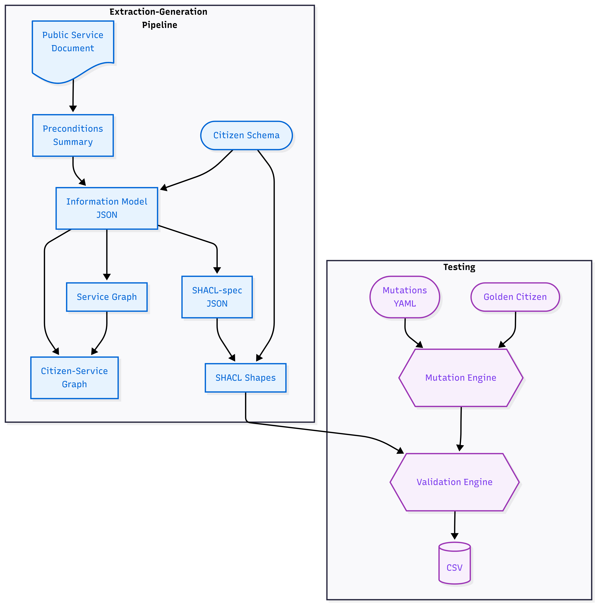

# Exploring Neuro-Symbolic Pipelines for Structured Knowledge Extraction
This repository presents a *Neuro-Symbolic Text → Graph → Logic pipeline*, grounded in Semantic Web and Knowledge Graph technologies, that uses LLMs to extract eligibility rules from legislative text and synthesize executable SHACL/SPARQL constraints for automated eligibility checking.
A *custom Mutation Testing framework* is introduced to evaluate functional correctness, revealing that syntactically valid AI-generated rules frequently fail under controlled logical perturbations.
The system is evaluated for real-world feasibility under the use case of a *Public Service Recommender System*.

[Read the full written report here.](./Thesis/main.pdf)

## The Problem
Public administration often seems like a bureaucratic maze. Citizens are legally entitled to services and benefits to which they remain unaware, a gap that exists due to the complexity and fragmentation of the underlying legislation.

This project approaches this real-world issue as a Data Science challenge. How do we make legal prose machine-readable and validate citizen data against it, without losing mathematical certainty? Current AI approaches rely on Large Language Models, which offer linguistic fluency but lack formality and certainty. In digital governance, a hallucination is a potentially catastrophic failure. This work argues that we must decouple interpretation (Neural) from execution (Symbolic) to ensure accountability.

## Knowledge Sources & Data Models
The project operates over a Semantic Web–based knowledge representation stack and uses:
- **Unstructured Knowledge**: Natural language regulatory documents defining eligibility conditions for Greek public services (e.g., Special Parental Leave Allowance, Student Housing Allowance).
- **Structured Semantics**: European Commission standard vocabularies, specifically the Core Public Service Vocabulary (CPSV-AP) and the Core Criterion and Core Evidence Vocabulary (CCCEV), expressed in RDF/Turtle.
- **Large Language Models**: The neural layer utilizes Gemini 2.5 Flash and Pro through the free version of the API.

## Methodology
This dissertation is composed of four stages:
1. **The Extraction & Generation Pipeline**: Development of a multi-step workflow that uses LLMs to parse legal PDFs and extract eligibility preconditions. These are mapped to intermediate representations and materialized as RDF knowledge graphs, before being synthesized into executable SHACL (Shapes Constraint Language) and SPARQL constraints.
2. **Testing & Validation**: An execution environment based on PySHACL. The system is evaluated through a custom-built Mutation Testing framework that applies controlled ablations to "Golden" citizen profiles to detect logic collapse. Different prompting strategies and LLMs are tested, keeping logs.
3. **Results Data Analysis**: Post-hoc statistical analysis of experimental logs. This phase focuses on quantifying the effect of different experimental configurations and assessing the overall real-life feasibility of the project.
4. **Report**: An analytical written report, typeset in LaTeX, documenting the whole process in a comprehensive way.

## Results and Key Takeaways
The experimental campaign reveals a sharp distinction between surface-level correctness and realistic reliability. In particular:
- **Syntactic Validity ≈80%**: Across models and prompting strategies, LLMs reliably generate SHACL and SPARQL artifacts that execute without syntax or runtime errors.
- **Functional Logic Accuracy ≈25%**: Only a minority of generated rule sets correctly enforce eligibility logic. Cases involving complex dependencies or recursive relationships were especially problematic.
Crucially, most failures are silent rather than catastrophic: the code runs, but the logic is wrong. These results demonstrate that linguistic competence does not imply logical correctness.

For digital governance systems, syntactic success is insufficient.  Symbolic validation layers are a prerequisite for trustworthy, auditable public service automation.

## Future Work
- **Scaling**: I plan to expand the project to include more classes of the EU vocabularies, and to improve the testing framework with more granular data logging. Testing configurations will include more documents, prompting strategies and model classes.
- **Artifact Deep Analysis**: I am in the process of carefully analyzing the artifacts produced by the pipeline to identify more failure modes, if they exist, and interpret them.
- **Digital Sovereignty**: I am working on migrating the neural layer from cloud-based APIs to Local LLMs (e.g., Llama) hosted on private infrastructure. 
- **Human-in-the-loop UI**: An idea for a next step is building a dashboard for legal experts to visualize and "patch" the synthesized logic shapes. At first, this will work as a complimentary tool for Artifact Deep Analysis.

## Repository Contents
`Citizens:` Domain-specific ontologies (RDFS) and YAML-based mutation scenarios for the test suites.

`Good results:` A curated collection of successful pipeline artifacts to be used as example outputs.

`Precondition documents:` The raw legislative PDF sources used as input for the extraction phase.

`Prompts:` System instructions for the different pipeline stages and prompting strategies.

`Thesis:` Full LaTeX source code, images and bibliography for the dissertation report. Includes a compiled PDF.

`src:` Core Python code for the execution of the pipeline pipeline, including local libraries for utility code.

`Experimennt Cockpit.ipynb:` The primary interactive environment for pipeline iterations and mutation testing loops.

`Master_Results.csv`: The dataset containing logs for all experimental runs.

`Results Analysis.ipynb`: Data Analysis and visualization of the experimental logs.

## Project Context
This dissertation was submitted as a requirement for the MSc in Data Science at the International Hellenic University.
